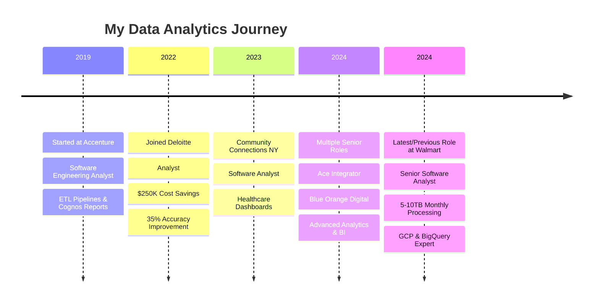

#  Hey there! I'm Rayon Hussain

  
  
  
  
  

---

## 🎯 About Me

### 🚀 Senior Data Analyst and Engineer | 5+ Years Experience

Senior Data Analyst and Engineer with expertise across retail, finance, and healthcare sectors. I specialize in transforming complex data into actionable insights that drive business decisions.

### 📊 Key Achievements
- **40% reduction** in manual operations through automated data pipelines
- **98% improvement** in reporting accuracy via stringent data validation
- **20% increase** in service satisfaction through effective data integration
- **30% improvement** in regulatory reporting accuracy

---

📊 <b>Click to see my journey in numbers</b>

 

| 🏢 **Companies** | 📈 **Impact** | 🛠️ **Technologies** |
|:---|:---|:---|
| **Walmart** | 60+ incidents resolved monthly | GCP, BigQuery, SQL, Confluence |
| **Blue Orange Digital** | 25% faster month-end close | Tableau, Salesforce, Teradata, Excel |
| **Ace Integrator** | 20% increase in insights | Python, PostgreSQL, Looker, Market Analytics |
| **Deloitte** | $250K annual savings | Tableau, KPI Analysis, IBM Cognos, Reporting and Dashboarding |
| **Accenture** | 35% faster data delivery | Snowflake, Azure, Python, AWS, ML Modelling |

---

## 🛠️ Tech Stack & Tools

### 📊 Data Visualization & BI

### 💻 Programming Languages

### ☁️ Cloud Platforms

### 🗄️ Databases

---

## 🏆 Certifications & Achievements

🎖️ <b>Click to view my certifications (8 Major Certifications)</b>

 

| Cloud Platforms | Data & Analytics | Specializations |
|:---:|:---:|:---:|
| ☁️ **AWS Certified Data Engineer** | 📊 **Databricks Certified Data Analyst** | 🔍 **HackerRank SQL (Intermediate)** |
| 🔵 **Azure Data Engineer Associate** | 📈 **Databricks Certified Data Engineer** | 📋 **Tableau Desktop Certified** |
| 🔵 **Azure Database Admin (DP-300)** | 📊 **Power BI Data Analyst (PL-300)** |  |
| 🟡 **Google Cloud Professional Data Engineer** |  |  |

---

## 🚀 Featured Projects

### 🎵 Real-time AWS Data Pipeline

**🔧 Tech Stack:** `AWS RDS` `Lambda` `Glue` `Kinesis` `Spotify API`  
**💡 What it does:** Real-time music data processing and analytics  
**🎯 Impact:** Automated data workflows with 99.9% uptime

**[🔗 View Repository](https://github.com/rayonhussain/AWS_Projects/tree/main/Main%20Projects)**

---

### 📊 Interactive Analytics Dashboards

**🔧 Tech Stack:** `Tableau` `Python` `PostgreSQL` `REST APIs`  
**💡 What it does:** HR & Sports analytics with interactive visualizations  
**🎯 Impact:** 25% improvement in decision-making efficiency

**[🔗 HR Dashboard](https://public.tableau.com/app/profile/rayon.hussain/viz/HREmployeeDashboard2/Dashboard1)**

**[🔗 European Football Leagues](https://public.tableau.com/app/profile/rayon.hussain/viz/EuropeanFootballLeagueAnalysis/MainStory)**

---

### 🏥 Healthcare Risk Assessment System

**🔧 Tech Stack:** `Python` `Machine Learning` `Tableau` `SQL`  
**💡 What it does:** Predictive analytics for healthcare risk assessment  
**🎯 Impact:** Improved identification of at-risk individuals by 30%

---

## 📈 GitHub Analytics

  
  

  
  
  

---

## 🏢 Professional Journey

---

## 🎯 What I'm Up To

<table>
<tr>
<td width="50%">

### 🔭 Currently Working On
- Advanced ML models for predictive analytics
- Real-time data streaming with Kafka
- Building scalable data pipelines on AWS

### 🌱 Learning
- Flutter App Development
- Advanced Databricks features
- MLOps with Azure ML
- Data Mesh architecture

</td>
<td width="50%">

### 💡 Fun Facts About Me
- 🎵 I use Spotify API for data projects
- ⚽ Built analytics for football data
- 🎯 Love turning complex data into simple stories
- 🌍 Worked across 3 continents remotely

### 📫 Coffee Chat?
I'm always open to discussing:
- Data strategies
- Career transitions
- Latest in analytics

</td>
</tr>
</table>

---

## 🤝 Let's Connect & Collaborate!

---

**💭 "In God we trust. All others must bring data." - W. Edwards Deming**

---

